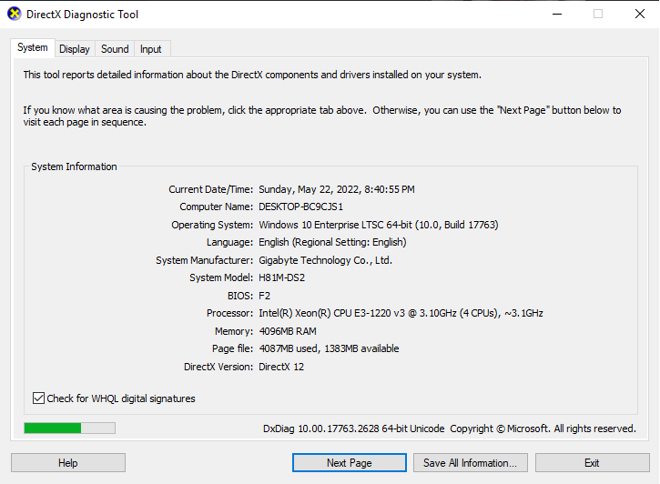

## H81M-DS2-Hackintosh

OpenCore EFI folder for mainboard Gigabyte H81M-DS2 (rev3.0).


[](https://github.com/dtcu0ng/H81M-DS2-Hackintosh/releases) [](https://github.com/dtcu0ng/H81M-DS2-Hackintosh/releases) [](https://github.com/dtcu0ng/H81M-DS2-Hackintosh/actions)

English | [Vietnamese](README_vi.md)

- [x] Windows 10
- [x] macOS Catalina

## Sections:
[PC specification](#pc-specification)

[Compatible with](#compatible-with)

[What is working](#what-is-working)

[Guide for low-ends CPUs](#guide-for-low-end-cpus)

[How to correctly download EFI](#how-to-download-efi)

[Additional](#additional)

[Thanks](#thanks)

## PC specification

| Part  | Info |
| ------------- | ------------- |
| Mainboard | Gigabyte H81M-DS2 (rev3.0), BIOS version F2  |
| CPU:  | Intel Xeon E3-1220 v3 (Haswell, 3,10 GHZ up to 3,50GHz, 4 core 4 thread)  |
| RAM:  | 4GB (DDR3-1600)  |
| GPU:  | NVIDIA Geforce GT 730 (GK208B, 128bit, 2GB GDDR5), natively support in Mojave, Catalina. (*) |
| Disk:  | Netac SSD 128GB, WD Blue 256GB  |
| Network: | Realtek RTL8111 |
| Sound:  | Realtek ALC887 (best layout-id in my build is 3)  |
| SMBIOS:  | iMac15,1  |


| Windows  | macOS |
| ------------- | ------------- |
|  |   |

## Compatible with

- [x] Windows 10
- [x] macOS Monterey Beta 1*
- [x] macOS Big Sur
- [x] macOS Catalina
- [x] macOS Mojave
- [x] macOS High Sierra
- [x] macOS Sierra
- [x] Mac OS X El Captain

Notes:

(*): macOS 12 Monterey does not support iMac15,1 or older SMBIOS, use iMac16,1 (if you only have iGPU) or iMac17,1 (if you have dGPU) and add -lilubetaall to boot-args.

(*): Apple dropped support for Kepler NVIDIA grapics card since Monterey Beta 7, so you need be cautious, if you in Monterey < Beta 6, don't update to Beta 7 or just go back to earlier version like Big Sur, Catalina,...

## What is working

- [x] Microphone (pink 3.5mm input)
- [x] Speaker (green 3.5mm input)
- [x] Ethernet (en0)
- [x] Services (App Store, Apple Music,...)
- [x] Graphics card*
- [x] Intel QuickSync/Hardware Acceleration
- [x] USB 2.0/3.0
- [x] Bootcamp**
- [ ] You tell me.

Notes: 

(*): GT730 (Kepler) is natively support in Catalina, other NVIDIA card please check before install Mojave or above.

(*): You may have screen flickering sometimes, add agdpmod=pikera in boot-arg may fix it. 

(**): If Bootcamp don't work in your machine, you need select another OS disk in UEFI settings to boot another OS.

## Guide for low-end CPUs
+ Because macOS don't support low-end CPUs like Pentium, Celeron, so we need a use the Fake CPUID and some changes, patches for that CPU to boot in MacOS:

Tutorial:
+ In your config.plist, goto Kernel > Emulate add these data into required value
```
Cpuid1Data: A9060300 00000000 00000000 00000000
Cpuid1Mask: FFFFFFFF 00000000 00000000 00000000
```
+ Set Kernel > Emulate > DummyPowerManagement to Enabled/True
+ Set NVRAM > WriteFlash to Disabled/False
+ Replace HFSPlus.efi with [HFSPlusLegacy.efi](https://github.com/acidanthera/OcBinaryData/blob/master/Drivers/HfsPlusLegacy.efi)
+ Don't forget to take an OC Snapshot in ProperTree after you work with files!
+ Some problem are described/fix like this [Reddit](https://www.reddit.com/r/hackintosh/comments/gn41rk/stuck_in_oc_watchdog_status_is_0/) post.

## How to download EFI
+ To download the latest EFI, simply click the download badge on the very first lines of README. If you don't want to scroll up, I've bring it down here for you: [](https://github.com/dtcu0ng/H81M-DS2-Hackintosh/releases)

Here is another way you can correctly download the EFI:

| DON'T use this  | Use this | And this |
| ------------- | ------------- | ------------- |
|  |  |  |

## Additional
+ (Only High Sierra) If you have NVIDIA graphics card, use this terminal command to install Web driver

```
bash <(curl -s https://raw.githubusercontent.com/Benjamin-Dobell/nvidia-update/master/nvidia-update.sh)
```
Code by [Benjamin-Dobell](https://github.com/Benjamin-Dobell/), use this [link](https://github.com/Benjamin-Dobell/nvidia-update/) to learn more.
+ (Only High Sierra) I installed CUDA driver too, get this in [here](https://www.nvidia.com/en-us/drivers/cuda/mac-driver-archive/)
+ Updating...
## Thanks
+ [hackintosh.vn](https://hackintosh.vn) for Vietnamese guides
+ [Olarila](https://olarila.com) for English guides, configs
+ [Benjamin-Dobell](https://github.com/Benjamin-Dobell/) for NVIDIA Web scripts
+ [Dortania](https://dortania.github.io/OpenCore-Install-Guide/) for OpenCore guides
