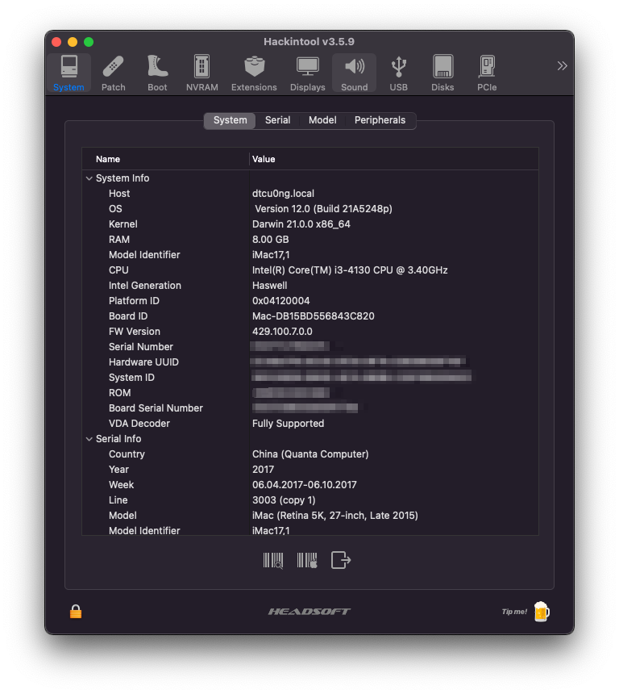

# H81M-DS2-HackintoshEFI

[](https://github.com/dtcu0ng/H81M-DS2-Hackintosh/actions)

[English](README) | Vietnamese

OpenCore EFI cho bo mạch chủ Gigabyte H81M-DS2 (rev3.0)

| Đang chạy  | (các) hệ điều hành |
| ------------- | ------------- |
| ✅  | Windows 10  |
| ✅  | macOS Monterey |

# Cấu hình PC của mình:

| Bộ phận  | Tên |
| ------------- | ------------- |
| Bo mạch chủ | Gigabyte H81M-DS2 (rev3.0), BIOS version F3  |
| CPU:  | Intel Core i3-4130 (Haswell, 3,40GHz, 2 core 4 thread)  |
| RAM:  | 8GB (2x4GB)  |
| GPU:  | NVIDIA Geforce GT 730 (GK208B, 128bit, 2GB GDDR5), hỗ trợ trực tiếp trên Mojave, Catalina, Big Sur. |
| Ổ cứng:  | Netac SSD 128GB (đã cài macOS 11.3.1, WD Blue 256GB (đã cài Windows 10)  |
| Mạng: | Realtek RTL8111 |
| Âm thanh:  | Realtek ALC887 (mình đang sử dụng layout-id là 3)  |
| SMBIOS:  | iMac15,1  |

| Windows  | macOS |
| ------------- | ------------- |
|  |   |

# Cấu hình này đã chạy

| Trạng thái | Hệ điều hành & phiên bản |
| ------------- | ------------- |
| ✅  | Windows 10  |
| ✅  | macOS Monterey Beta 1* |
| ✅  | macOS Big Sur |
| ✅  | macOS Catalina |
| ✅  | macOS Mojave  |
| ✅  | macOS High Sierra  |
| ✅  | macOS Sierra  |
| ✅  | Mac OS X El Captain  |

Lưu ý:
(*): macOS 12 (Monterey) không hỗ trợ SMBIOS iMac15,1 trở xuống, vì vậy hãy dùng SMBIOS iMac16,1 (nếu bạn không sử dụng iGPU) hoặc iMac17,1 (nếu bạn sử dụng dGPU) và thêm -lilubetaall vào boot-args.

# Những thứ đang hoạt động
| Tình trạng  | Chức năng: |
| ------------- | ------------- |
| ✅  | Microphone (lỗ cắm màu hồng trên mainboard)  |
| ✅  | Loa (lỗ cắm màu xanh trên mainboard)  |
| ✅  | Mạng LAN (en0)  |
| ✅  | iServices (App Store, Apple Music, đăng nhập ID Apple,...) |
| ✅  | Card màn hình* |
| ✅  | Intel QuickSync/Tăng tốc phần cứng |
| ✅  | USB 2.0/3.0  |
| ✅  | Bootcamp***  |

Ghi chú: 
(*): GT730 (Kepler) được hỗ trợ trực tiếp bởi Apple trong các phiên bản Mojave, Catalina, Big Sur.
(***): Nếu Bootcamp không hoạt động trên PC của bạn, có thể bạn phải ấn F12 để chọn boot.

# Không hoạt động
| Tình trạng  | Chức năng: |
| ------------- | ------------- |
| ❌  | iMessages, Facetime  |


# Hướng dẫn cho các CPU dòng Pentium, Celeron
+ Bởi vì macOS không hỗ trợ các dòng CPU Pentium, Celeron nên chúng ta cần phải làm một số thủ thuật và thay đổi để lừa macOS rằng nó đang chạy trên một CPU thích hợp (các dòng Core i, Xeon)

Hướng dẫn:
+ Trong config.plist của bạn, thêm một số dữ liệu vào các ô cần thiết ở mục Kernel > Emulate
```
CpuidData: A9060300 00000000 00000000 00000000
CpuidMask: FFFFFFFF 00000000 00000000 00000000
```
+ Bật Kernel > DummyPowerManagement
+ Tắt NVRAM > WriteFlash
+ Thay thế HFSPlus.efi sang [HFSPlusLegacy.efi](https://github.com/acidanthera/OcBinaryData/blob/master/Drivers/HfsPlusLegacy.efi)
+ Đừng quên sử dụng chức năng OC Snapshot trong ProperTree khi bạn vừa làm việc với các tệp tin (kext, driver, ACPI,...)
+ Các hướng dẫn trên được mình tìm hiểu và thử nghiệm dựa trên bài đăng [Reddit](https://www.reddit.com/r/hackintosh/comments/gn41rk/stuck_in_oc_watchdog_status_is_0/) này.

# Cách để tải EFI xuống:
| KHÔNG dùng cách này  | Dùng cách này | Và thế này |
| ------------- | ------------- | ------------- |
| images/dont_use_this_to_download.png  | images/use_this.png | and_this.png |

# Chú thích
+ Nếu bạn sử dụng card đồ hoạ GT730 2GB GDDR5 từ Gigabyte giống mình, bạn nên thêm agdpmod=pikera trong boot-arg. Việc này sẽ sửa vấn đề nháy đen màn hình.

# Sau khi cài đặt
+ (Chỉ High Sierra) Nếu bạn có card NVIDIA được hỗ trợ (trừ các dòng RTX, GTX 16xx, 15xx), sử dụng câu lệnh này để tải NVIDIA Web Driver:

```
bash <(curl -s https://raw.githubusercontent.com/Benjamin-Dobell/nvidia-update/master/nvidia-update.sh)
```
Code bởi [Benjamin-Dobell](https://github.com/Benjamin-Dobell/), vào [link](https://github.com/Benjamin-Dobell/nvidia-update/) này để tìm hiểu thêm.
+ (Chỉ High Sierra) Mình cũng cài đặt thêm CUDA driver nữa, bạn có thể lấy nó ở [đây](https://www.nvidia.com/en-us/drivers/cuda/mac-driver-archive/)

# Credit & Cảm ơn
+ [hackintosh.vn](https://hackintosh.vn) cho các hướng dẫn trong Tiếng Việt
+ [Olarila](https://olarila.com) cho các config, hướng dẫn bằng Tiếng Anh
+ [Benjamin-Dobell](https://github.com/Benjamin-Dobell/) cho NVIDIA Web Script
+ [Dortania](https://dortania.github.io/OpenCore-Install-Guide/) cho các hướng dẫn về OpenCore.