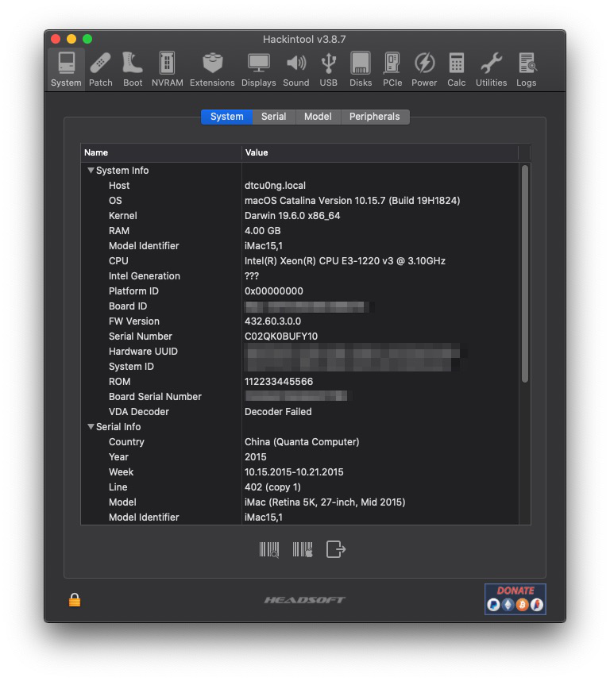
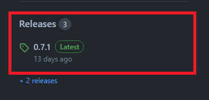
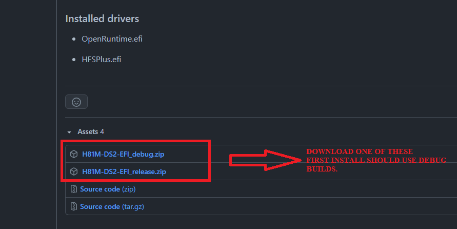

## H81M-DS2-Hackintosh

[](https://github.com/dtcu0ng/H81M-DS2-Hackintosh/releases) [](https://github.com/dtcu0ng/H81M-DS2-Hackintosh/releases) [](https://github.com/dtcu0ng/H81M-DS2-Hackintosh/actions)

[English](README) | Vietnamese

OpenCore EFI cho bo mạch chủ Gigabyte H81M-DS2 (rev3.0)

- [x] Windows 10
- [x] macOS Catalina

## Chỉ mục:
[Cấu hình PC](#cấu-hình-pc)

[Tương thích với](#tương-thích-với)

[Những thứ đang hoạt động](#những-thứ-đang-hoạt-động)

[Hướng dẫn cho các CPU cấp thấp](#hướng-dẫn-cho-các-cpu-cấp-thấp)

[Cách tải xuống EFI đúng cách](#cách-tải-xuống-efi-đúng-cách)

[Phần bổ sung](#phần-bổ-sung)

[Cảm ơn](#cảm-ơn)

## Cấu hình PC

| Bộ phận  | Tên |
| ------------- | ------------- |
| Bo mạch chủ | Gigabyte H81M-DS2 (rev3.0), BIOS version F3  |
| CPU:  | Intel Xeon E3-1220 v3 (Haswell, 3,10 GHZ up to 3,50GHz, 4 core 4 thread)  |
| RAM:  | 8GB (2x4GB)  |
| GPU:  | NVIDIA Geforce GT 730 (GK208B, 128bit, 2GB GDDR5), hỗ trợ trực tiếp trên Mojave, Catalina, Big Sur. (*) |
| Ổ cứng:  | Netac SSD 128GB, WD Blue 256GB  |
| Mạng: | Realtek RTL8111 |
| Âm thanh:  | Realtek ALC887 (mình đang sử dụng layout-id là 3)  |
| SMBIOS:  | iMac15,1  |


| Windows  | macOS |
| ------------- | ------------- |
|  |   |

## Tương thích với

- [x] Windows 10
- [x] macOS Monterey Beta 1*
- [x] macOS Big Sur
- [x] macOS Catalina
- [x] macOS Mojave
- [x] macOS High Sierra
- [x] macOS Sierra
- [x] Mac OS X El Captain

Lưu ý:

(*): macOS 12 (Monterey) không hỗ trợ SMBIOS iMac15,1 trở xuống, vì vậy hãy dùng SMBIOS iMac16,1 (nếu bạn không sử dụng iGPU) hoặc iMac17,1 (nếu bạn sử dụng dGPU) và thêm -lilubetaall vào boot-args.

(*): Apple đã dừng hỗ trợ cho các dòng card NVIDIA Kepler trên phiên bản macOS Monterey Beta 7, vì thế bạn nên chú ý cấu hình máy tính trước khi cài đặt. Đừng cập nhật lên Beta 7 nếu bạn đang ở phiên bản < Beta 6 hoặc quay lại các phiên bản cũ hơn như Big Sur hoặc Catalina.

## Những thứ đang hoạt động
- [x] Microphone (thông qua cổng 3.5mm màu hồng)
- [x] Loa/tai nghe (thông qua cổng 3.5mm màu xanh lá cây)
- [x] Mạng LAN (en0)
- [x] Các dịch vụ (App Store, Apple Music,...)
- [x] Card đồ hoạ*
- [x] Intel QuickSync/Tăng tốc phần cứng
- [x] USB 2.0/3.0
- [x] Bootcamp**
- [ ] Hãy kể cho mình những thứ chưa hoạt động.

Ghi chú: 

(*): GT730 (Kepler) được hỗ trợ trực tiếp bởi Apple trong các phiên bản Mojave, Catalina, Big Sur.

(*): Thỉnh thoảng bạn sẽ gặp lỗi màn hình nháy đen rồi trở lại bình thường nếu bạn dùng card giống với mình, hãy thử thêm agdpmod=pikera vào boot-arg.

(**): Hiện tại mình đang sử dụng CPU Xeon E3-1220v3, nhưng trước đó sử dụng CPU i3-4130 và Pentium G3250, tăng tốc phần cứng vẫn hoạt động bình thường.

(***): Nếu Bootcamp không hoạt động trên PC của bạn, có thể bạn phải ấn F12 để chọn boot.

## Hướng dẫn cho các CPU cấp thấp
+ Bởi vì macOS không hỗ trợ các dòng CPU cấp thấp như Pentium, Celeron nên chúng ta cần phải làm một số thủ thuật và thay đổi để đánh lừa macOS rằng nó đang chạy trên một CPU thích hợp (các dòng Core i, Xeon)

Hướng dẫn:
+ Trong config.plist của bạn, thêm một số dữ liệu vào các ô cần thiết ở mục Kernel > Emulate
```
CpuidData: A9060300 00000000 00000000 00000000
CpuidMask: FFFFFFFF 00000000 00000000 00000000
```
+ Bật Kernel > Emulate > DummyPowerManagement
+ Tắt NVRAM > WriteFlash
+ Thay thế HFSPlus.efi sang [HFSPlusLegacy.efi](https://github.com/acidanthera/OcBinaryData/blob/master/Drivers/HfsPlusLegacy.efi)
+ Đừng quên sử dụng chức năng OC Snapshot trong ProperTree khi bạn vừa làm việc với các tệp tin (kext, driver, ACPI,...)
+ Các hướng dẫn trên được mình tìm hiểu và thử nghiệm dựa trên bài đăng [Reddit](https://www.reddit.com/r/hackintosh/comments/gn41rk/stuck_in_oc_watchdog_status_is_0/) này.

## Cách tải xuống EFI đúng cách
+ Để tải xuống EFI, bạn chỉ cần ấn vào nút downloads ở những dòng đầu tiên của README. Còn nếu bạn không muốn kéo lên, thì mình đã đem xuống cho bạn rồi đây: [](https://github.com/dtcu0ng/H81M-DS2-Hackintosh/releases)

Còn đây cũng là một cách để tải về đúng EFI:

| KHÔNG dùng cách này  | Dùng cách này | Và thế này |
| ------------- | ------------- | ------------- |
|  |  |  |

## Phần bổ sung
+ (Chỉ High Sierra) Nếu bạn có card NVIDIA được hỗ trợ (trừ các dòng RTX, GTX 16xx, 15xx), sử dụng câu lệnh này để tải NVIDIA Web Driver:

```
bash <(curl -s https://raw.githubusercontent.com/Benjamin-Dobell/nvidia-update/master/nvidia-update.sh)
```
Code bởi [Benjamin-Dobell](https://github.com/Benjamin-Dobell/), vào [link](https://github.com/Benjamin-Dobell/nvidia-update/) này để tìm hiểu thêm.
+ (Chỉ High Sierra) Mình cũng cài đặt thêm CUDA driver nữa, bạn có thể lấy nó ở [đây](https://www.nvidia.com/en-us/drivers/cuda/mac-driver-archive/)
+ Vẫn đang tiếp tục được cập nhật...

## Cảm ơn
+ [hackintosh.vn](https://hackintosh.vn) cho các hướng dẫn trong Tiếng Việt
+ [Olarila](https://olarila.com) cho các config, hướng dẫn bằng Tiếng Anh
+ [Benjamin-Dobell](https://github.com/Benjamin-Dobell/) cho NVIDIA Web Script
+ [Dortania](https://dortania.github.io/OpenCore-Install-Guide/) cho các hướng dẫn về OpenCore.
